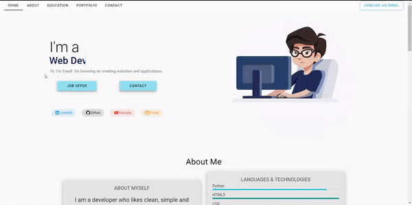

<h1 align="center">Portfolio Website with Vue.js & Vuetify</h1>

> It is a portfolio website made using Vue.js and Vuetify.
<br>
</img>
<br>
<p align="center"><strong> Live demo with my personnal data <a href="https://yusufonaran.me">here</a> ! </strong></p>

---

## Table of Contents

- [Features](#features)
- [Setup](#project-setup)
- [Versions](#versions)
- [Author](#author)
- [License](#-license)

---

## Features
- Builded with Vue.Js ✨
- Vuetify framework (beta version - next) ✨
- One page layout ✨
- Material design ✨
- Animated text ✨

## Project Setup
```
npm install
```
### Creating project
```
vue create "file name"
```
### Change directory
```
cd "file name"
```
### Add router
```
vue add router
```
### Add vuetify framework
```
vue add vuetify
```
### Compiles and hot-reloads for development
```
npm run serve
```
### Compiles and minifies for production
```
npm run build
```

## Versions
- Vue: 3.2.13
- Vue-router: 4.0.3
- Vuetify: npm:@vuetify/nightly@next


## Author

👤 **Yusuf Onaran**

* Github: [@onaranyusuf](https://github.com/onaranyusuf)
* LinkedIn: [@Yusuf Onaran](https://www.linkedin.com/in/yusufonaran/)
* Portfolio: [yusufonaran.me](https://www.yusufonaran.me)

## Show your support

Give a ⭐️ if this project helped you!

## 📝 License

This project is under [MIT](https://github.com/onaranyusuf/Portfolio-Website-with-Vue.js-Vuetify/blob/main/LICENSE) license.

